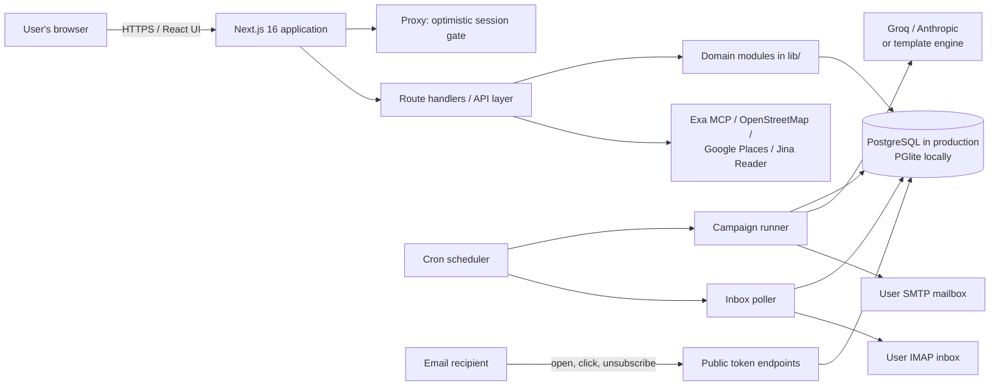
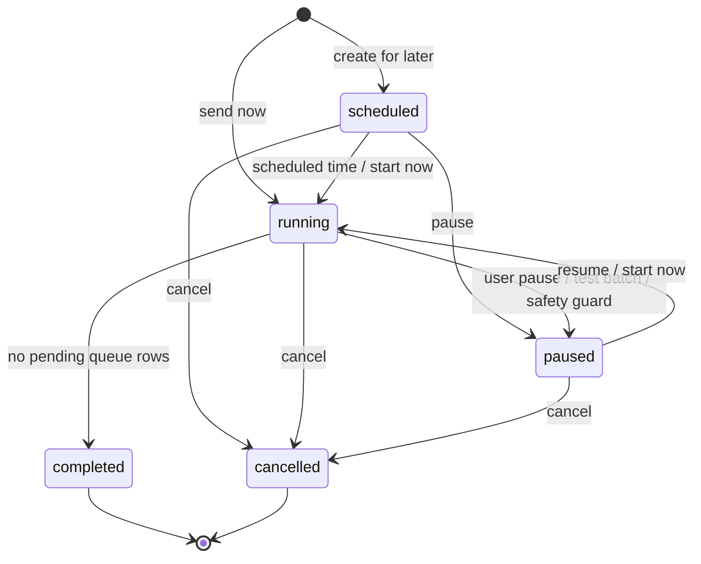
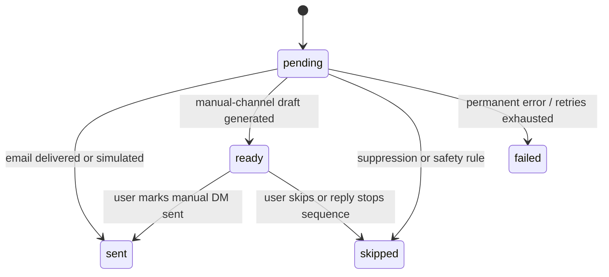

# Outreach Studio — Technical Interview Guide

> A code-based explanation of the product, architecture, backend, data model, security, integrations, deployment, tradeoffs, and likely interview questions.
>
> Verified against the repository on 13 August 2026. The test suite, ESLint, TypeScript checks, and production build all pass.

## 1. The product in one sentence

Outreach Studio is a multi-tenant SaaS that helps small businesses discover leads, import contacts, generate personalized outreach with AI, schedule email campaigns, prepare compliant manual Instagram and LinkedIn messages, detect replies and bounces, and measure engagement.

## 2. The problem and product value

Traditional outbound sales requires several disconnected tools:

1. A lead database or search tool.
2. A spreadsheet or CRM for contacts.
3. An AI writer or copywriter.
4. An email sender.
5. A scheduling and follow-up tool.
6. Inbox monitoring and analytics.

Outreach Studio combines those steps into one workflow:

```text
Discover/import leads
        ↓
Enrich and validate contact data
        ↓
Create a campaign and preview its message
        ↓
Snapshot the audience into a durable queue
        ↓
Generate and deliver/draft each message at the allowed pace
        ↓
Track opens, clicks, replies, bounces, and opt-outs
        ↓
Stop inappropriate follow-ups and report campaign results
```

The product is intentionally conservative. Email can be automated through the user's SMTP account, while Instagram and LinkedIn outreach is generated as a draft and manually sent by the user because automatic cold DMs create platform-policy and account-ban risk.

## 3. Interview-ready product pitch

### 30-second version

> I built Outreach Studio, a full-stack multi-tenant outreach SaaS. A user discovers or imports leads, creates a campaign, and the platform snapshots the recipients into a PostgreSQL-backed queue. A scheduler generates a personalized message for each contact using Groq, Anthropic, or a deterministic template fallback. Email is delivered through the user's SMTP account with throttling, send windows, unsubscribe headers, open/click tracking, retries, and daily caps. An IMAP worker detects replies and bounces so it can stop follow-ups automatically. The application is a modular monolith built with Next.js 16, React 19, TypeScript, PostgreSQL/PGlite, Nodemailer, ImapFlow, and node-cron.

### Two-minute technical version

> The system uses the Next.js App Router for both the React frontend and backend-for-frontend route handlers. The browser calls authenticated `/api` route handlers, and the backend keeps every business query scoped by `user_id` for tenant isolation. Locally, the same SQL runs on embedded Postgres through PGlite; production uses a normal PostgreSQL pool through `pg`.
>
> When a campaign is created, I use a database transaction to insert the campaign and one pending queue row per recipient. This locks the campaign audience at creation time but leaves the content dynamic: subject and body are generated only when each message becomes due, so editing the brief still changes unsent messages.
>
> A cron scheduler starts through Next.js instrumentation. Every minute it promotes due campaigns and processes one due message per campaign. A PostgreSQL advisory lock prevents two application instances from executing the same global tick. Before sending, the runner checks campaign state, send window, email verification, postal address, public unsubscribe URL, suppression flags, email safety, plan limits, warm-up cap, and exact per-mailbox pacing. It then calls Groq or Anthropic with structured JSON output, or falls back to an internal template engine. SMTP failures classified as transient retry up to three times with increasing backoff.
>
> Every two minutes, a second worker polls users' IMAP inboxes. It matches known senders to contacts, records replies, detects bounce notices, and uses AI or heuristics to classify replies. Those contact flags are checked again at send time, which stops unwanted follow-ups. Public tokenized endpoints record opens, clicks, and one-click unsubscribes. Secrets are AES-256-GCM encrypted, passwords use scrypt, sessions are HMAC-signed HttpOnly cookies, and authenticated queries enforce tenant ownership.

## 4. High-level architecture

Outreach Studio is a **modular monolith**. One deployable Next.js application contains UI, HTTP APIs, domain services, background jobs, and integration adapters. PostgreSQL is the durable source of truth.



### Why a modular monolith is appropriate

- It is simpler to build, deploy, debug, and operate than microservices.
- Frontend and backend share TypeScript types and one repository.
- The current sending volume can be handled by a single Node process and PostgreSQL.
- Transactional operations, such as campaign plus recipient queue creation, stay simple.
- Modules such as AI, mail, inbox processing, leads, authentication, and persistence already have useful boundaries and can be extracted later if required.

The tradeoff is that web traffic and background work currently share a process. Independent worker scaling, failure isolation, and high-throughput queues would require an architectural evolution.

## 5. Technology stack

| Layer | Technology | Why it is used |
|---|---|---|
| Language | TypeScript, strict mode | Shared types and safer full-stack changes |
| Web framework | Next.js 16.2, App Router | Pages, route handlers, proxy, metadata, and standalone production output |
| UI | React 19.2 | Interactive dashboard and forms |
| Styling | Tailwind CSS 4 plus global CSS | Fast component-level styling |
| Backend API | Next.js route handlers | Backend-for-frontend without a separate API service |
| Production database | PostgreSQL 17 | Transactions, relational integrity, indexes, filtering, and advisory locks |
| Local database | PGlite | Embedded Postgres with almost the same SQL and no local DB server |
| Database access | Raw parameterized SQL through a small adapter | Direct control and no ORM runtime overhead |
| AI | Groq OpenAI-compatible API and Anthropic SDK | Provider choice, JSON output, and per-user/global-key modes |
| Email delivery | Nodemailer over SMTP | Works with the user's existing mailbox/provider |
| Inbox processing | ImapFlow | Reply and bounce detection through IMAP |
| Scheduling | node-cron | Minute-level campaign and inbox jobs |
| CSV import | Papa Parse | Flexible contact imports |
| Lead discovery | Exa MCP, OpenStreetMap Overpass, Google Places | Multiple lead sources with different cost/coverage profiles |
| Website enrichment | Native fetch plus optional Jina Reader fallback | Extract contact data from normal and JS-heavy sites |
| Containers | Multi-stage Docker build and Docker Compose | Reproducible application, database, and backup services |
| Tests | Node's built-in test runner | Lightweight unit tests without another test framework |

## 6. Repository structure

```text
app/
  api/                    Next.js route handlers (the HTTP backend)
  components/             Shared UI and application shell components
  dashboard/              Analytics and setup overview
  contacts/               Contact import and management UI
  campaigns/              Campaign creation/list/detail UI
  leads/                  Lead discovery and enrichment UI
  messages/               Manual DM drafts and reply triage
  settings/               Identity, mail, AI, and deliverability settings
  billing/                Plan and usage presentation
  admin/                  Instance administration
lib/
  db.ts                   DB adapter, schema, migrations, row types
  auth.ts / crypto.ts     Accounts, passwords, sessions, tokens, encryption
  runner.ts               Campaign queue processor and send safeguards
  scheduler.ts            Cron lifecycle
  ai.ts / templates.ts    AI generation and non-AI fallback
  mailer.ts               SMTP, HTML/text formatting, tracking, compliance
  inbox.ts                IMAP reply/bounce processing
  leads.ts / exa.ts       Search, scraping, enrichment, people lookup
  settings.ts             Per-user settings and encrypted secrets
  plans.ts / usage.ts     SaaS limits and metering
  ratelimit.ts            In-memory and database-backed fixed windows
tests/                    Domain-level unit tests
proxy.ts                  Public/private route gate
instrumentation.ts        Scheduler startup hook
Dockerfile                Standalone Next.js production image
docker-compose.yml        App, PostgreSQL, and nightly backups
```

## 7. Frontend architecture

The public marketing and legal pages are primarily statically generated. Authenticated product pages are mostly client components that load JSON from route handlers using `fetch`, maintain form/loading/error state, and render reusable application-shell components.

Important UI areas are:

- Dashboard: aggregate metrics, 14-day activity, recent activity, upcoming campaigns, mailbox health, and onboarding checklist.
- Contacts: manual entry, CSV import, search, editing, and suppression status.
- Lead Finder: source selection, search filters, enrichment, owner lookup, CSV download, and contact import.
- Campaigns: channel selection, audience filter, brief, tone, schedule, pace, follow-ups, A/B testing, test batch, preview, and controls.
- Message Center: manual Instagram/LinkedIn workflow and reply triage.
- Settings: sender identity, SMTP/IMAP, AI provider, lead-source key, timezone, daily cap, warm-up, and public URL.
- Billing/Admin: current plan/usage and manual instance-level user-plan administration.

### Frontend/backend boundary

The frontend never connects directly to the database or mail providers. It calls same-origin `/api/*` routes. Route handlers re-check the authenticated user and perform server-only work. Secrets are masked in API responses and remain encrypted in storage.

### Current frontend tradeoff

Many authenticated pages are client-heavy and fetch after hydration. This is straightforward for an application dashboard, but it creates extra round trips and larger client bundles. A future version could move initial reads into server components and reserve client components for interactive islands.

## 8. Backend API design

Next.js route handlers form the backend-for-frontend API. Dynamic data routes run on demand and use the Node runtime because the application needs Node libraries such as SMTP, IMAP, filesystem access, `pg`, and crypto.

### Main API groups

| Group | Representative methods | Responsibility |
|---|---|---|
| `/api/auth/*` | signup, login, logout, me, verify, forgot/reset | Account and session lifecycle |
| `/api/contacts` | GET, POST | Search, manual add, CSV import, upsert |
| `/api/contacts/[id]` | PATCH, DELETE | Tenant-scoped contact mutations |
| `/api/campaigns` | GET, POST | Campaign summaries and transactional creation |
| `/api/campaigns/[id]` | GET, PATCH, DELETE | Details, state transitions, editing, deletion |
| `/api/campaigns/preview` | POST | Generate a sample and run spam checks |
| `/api/campaigns/improve` | POST | Turn a rough idea into a structured brief |
| `/api/leads` | POST | Lead search, enrichment, quota enforcement, optional import |
| `/api/leads/people` | POST | Decision-maker search |
| `/api/messages` | GET, PATCH | Manual draft workflow and sequence state |
| `/api/replies` | GET, PATCH | Reply triage workflow |
| `/api/stats` | GET | Dashboard aggregation and onboarding state |
| `/api/settings` | GET, POST | Read masked settings and save encrypted values |
| `/api/billing` | GET | Plan and metered-usage snapshot |
| `/api/admin/users` | GET, PATCH | Admin user/plan operations |
| `/api/t/o/[token]` | GET | Open pixel |
| `/api/t/c/[token]` | GET | Click tracking and safe redirect |
| `/api/unsubscribe` | GET, POST | Human and RFC 8058 one-click opt-out |
| `/api/health` | GET | Database health check |

### API conventions used

- `NextResponse.json()` for structured results.
- Correct use of 400, 401, 403, 404, 409, and 429 for common failures.
- Parameterized SQL (`$1`, `$2`, and so on) to prevent SQL injection.
- Ownership predicates such as `WHERE id = $1 AND user_id = $2`.
- Transactions around multi-row operations.
- Server-side normalization and validation rather than trusting browser state.
- Public endpoints are narrowly allowlisted and token/rate-limit protected.

## 9. Database and multi-tenancy

The database abstraction exposes `query`, `exec`, and `transaction`. With `DATABASE_URL`, it uses a `pg.Pool` with up to ten connections. Without it, it initializes disk-backed PGlite under `data/pg` and serializes local transactions.

### Core schema

```mermaid
erDiagram
    USERS ||--o{ SETTINGS : owns
    USERS ||--o{ CONTACTS : owns
    USERS ||--o{ CAMPAIGNS : owns
    USERS ||--o{ EMAILS : owns
    USERS ||--o{ REPLIES : owns
    USERS ||--o{ USAGE_DAILY : meters
    USERS ||--o{ AI_USAGE : meters
    CAMPAIGNS ||--o{ EMAILS : queues
    CONTACTS ||--o{ EMAILS : receives
    CONTACTS ||--o{ REPLIES : sends

    USERS {
      int id PK
      text email UK
      text password_hash
      int is_admin
      int email_verified
      text plan
    }
    SETTINGS {
      int user_id PK_FK
      text key PK
      text value
    }
    CONTACTS {
      int id PK
      int user_id FK
      text email
      text business_name
      text email_status
      int replied
      int bounced
      int unsubscribed
      text unsub_token
    }
    CAMPAIGNS {
      int id PK
      int user_id FK
      text channel
      text status
      timestamp scheduled_at
      int throttle_per_hour
      int followup_count
    }
    EMAILS {
      int id PK
      int user_id FK
      int campaign_id FK
      int contact_id FK
      int step
      text status
      timestamp scheduled_for
      timestamp sent_at
      timestamp opened_at
      timestamp clicked_at
      timestamp replied_at
    }
```

### Table responsibilities

- `users`: account, password hash, admin flag, verification/reset tokens, plan.
- `settings`: flexible per-user key/value storage; sensitive values are encrypted.
- `contacts`: recipient data and durable suppression/safety flags.
- `campaigns`: campaign configuration and state.
- `emails`: both the durable work queue and the delivery/engagement log. Despite its name, it also stores manual Instagram and LinkedIn drafts.
- `replies`: inbound reply snippets, classification, suggested response, and handled state.
- `usage_daily`: generic lead/feature metering.
- `ai_usage`: included-AI daily metering.
- `rate_limits`: durable auth-sensitive rate-limit buckets.

### Tenant isolation

This is application-level multi-tenancy in a shared schema. Every owned row includes `user_id`, and authenticated queries filter by it. Foreign keys use `ON DELETE CASCADE` to remove a user's dependent data if the user is deleted.

This approach is cost-efficient and simple for an early SaaS. At larger enterprise scale, possible hardening includes PostgreSQL row-level security, repository helpers that require tenant context, audit logs, and tests specifically designed to detect cross-tenant access.

### Schema management tradeoff

The schema and `ALTER TABLE ... IF NOT EXISTS` migrations run during database initialization. That makes self-hosting easy, but it is less auditable than versioned migrations. A production evolution would use a migration tool and a deployment step with ordered, reversible migration files.

## 10. Authentication and authorization

### Account flow

1. Signup validates the address and minimum eight-character password.
2. Passwords are salted and hashed with Node's `scrypt`.
3. The first account on a fresh instance becomes the administrator.
4. If a system mailer is configured, verification is enforced and a hashed, expiring token is emailed.
5. Login returns a 30-day signed session cookie.
6. Forgot-password responses avoid account enumeration; reset tokens are random, stored only as SHA-256 hashes, expire after one hour, and are consumed once.

### Session design

The cookie format is conceptually:

```text
userId.expiryTimestamp.HMAC_SHA256(userId.expiryTimestamp, APP_SECRET)
```

Cookie flags are `HttpOnly`, `SameSite=Lax`, path `/`, and `Secure` in production unless explicitly disabled for a local/LAN deployment.

`proxy.ts` performs an optimistic signature check and redirects unauthenticated page requests. It is deliberately not the only authorization layer: each protected route handler resolves the session and checks that the user still exists.

### Authorization

- Ordinary resources are scoped by `user_id`.
- Admin endpoints also call `isAdmin`.
- State transitions are constrained: for example, a running campaign must be paused or cancelled before deletion.
- The public allowlist includes authentication, health, marketing, tracking, and unsubscribe endpoints only.

### Session tradeoff

Sessions are stateless and inexpensive, but there is no server-side session table. Therefore, individual sessions cannot be centrally listed or revoked before expiry without changing `APP_SECRET`, deleting the user, or adding a session-version/revocation mechanism.

## 11. Secret and data protection

- SMTP/IMAP passwords and API keys use AES-256-GCM authenticated encryption.
- A SHA-256 digest of `APP_SECRET` becomes the encryption key.
- Each encryption uses a random 12-byte IV and stores the authentication tag.
- Production receives a stable `APP_SECRET` from the environment.
- Local development generates `data/.secret` with mode `0600` when no secret exists.
- Stored secrets are decrypted only on the server and returned to the UI as a fixed mask.
- Passwords are not encrypted; they are one-way scrypt hashes.
- Verification and reset tokens are also stored as hashes, so a database leak does not reveal usable raw tokens.
- Baseline response headers disable MIME sniffing, framing, camera, microphone, and geolocation and use a strict referrer policy.

Important interview distinction: **hashing** is appropriate for passwords and one-time token comparisons; **encryption** is required for SMTP passwords and API keys because the application must recover them to call external services.

## 12. Campaign creation and queue model

Campaign creation is transactional:

1. Authenticate the user.
2. Validate name, brief, channel, schedule, limits, and compliance settings.
3. Query eligible contacts for the selected category/channel.
4. Start a transaction.
5. Insert the campaign.
6. Insert one pending `emails` row per recipient.
7. Commit or roll back the whole operation.

This gives two useful semantics:

- **Audience is snapshotted:** later contact imports do not unexpectedly enter an existing campaign.
- **Content is just-in-time:** subject and body are generated at delivery time, so edits to the campaign brief/tone affect unsent queue items.

### Campaign state machine



### Message state machine



## 13. Scheduler and campaign runner

Next.js calls `instrumentation.ts` when a Node server starts. It dynamically loads the scheduler, which initializes the database and registers:

- campaign processing every minute;
- inbox polling every two minutes;
- an immediate campaign/inbox check on boot.

### Duplicate-work protection

There are two guards:

- an in-process boolean prevents overlapping ticks in the same Node process;
- PostgreSQL `pg_try_advisory_lock` prevents two app instances sharing the database from running the global tick at the same time.

PGlite is local/single-process, so advisory-lock failure falls back safely there.

### Pre-send checks

Before one queue item is sent, the runner verifies:

1. Campaign is still `running`.
2. Current hour is inside the configured timezone-aware send window.
3. Test-batch boundary has not been reached.
4. A verified account is available when real SMTP and verification enforcement are active.
5. A public base URL exists for working unsubscribe/tracking links.
6. A postal address exists for commercial email compliance.
7. Exact spacing based on `throttle_per_hour` has elapsed since the last send.
8. Contact still exists.
9. Contact is not unsubscribed or previously bounced.
10. Contact has the required channel address/profile.
11. Address syntax/disposable/MX safety status is acceptable and fresh.
12. A follow-up recipient has not replied.
13. User/warm-up/plan daily SMTP cap has not been reached.

It processes only one email per campaign per scheduler tick. This prevents bursts from a single mailbox and provides durable pacing based on `sent_at`, including across restarts.

### Failure handling

Errors that look temporary—network errors, timeouts, DNS problems, greylisting, provider rate limits, SMTP 4xx responses—remain pending and retry up to three attempts. Backoff is 10 minutes after the first failure and 20 after the second. Permanent errors or exhausted retries mark the row `failed` with the error text.

## 14. AI generation system

### Provider resolution

The user may choose:

- `auto`: prefer the instance's global Groq key, then global Anthropic key;
- `groq`: use the user's Groq key, with the environment key as fallback;
- `anthropic`: use the user's Anthropic key, with the environment key as fallback;
- no usable provider: use the built-in template engine.

The code distinguishes a platform-funded global key from a user's own key. Global-key use is gated by email verification, plan quota, and an optional operator-wide per-user ceiling. Own-key use is not metered by the application.

### Prompt design

Prompts combine:

- sender identity and company description;
- channel-specific writing rules;
- contact business name, category, website, profiles, and notes/intelligence;
- campaign brief and tone;
- previous message for follow-ups;
- deterministic A/B subject strategy when enabled.

Anthropic uses JSON Schema structured output. Groq uses JSON mode with an explicit expected object. The application parses `{ subject, body }` for email or `{ body }` for social messages.

### Graceful degradation

The template engine is a deliberate resilience and cost-control feature. If no key is configured or included AI has reached its quota, campaigns continue with rotating, tone-aware templates. Delivery rows record `+template` in the `via` field so the UI can disclose that fallback.

One limitation is that provider call failures during an actual queued send are handled by the general retry/failure logic; they do not automatically retry the same item with a template during that attempt.

### Reply intelligence

Inbound reply text is classified into `interested`, `question`, `not_interested`, `out_of_office`, or `other`. With AI, a suggested response is generated for useful categories. Without AI or after an AI failure, keyword and punctuation heuristics still classify the reply.

## 15. Email delivery and tracking

### SMTP sending

Nodemailer creates a transporter using each user's settings. It uses connection, greeting, and socket timeouts so a hung mail server cannot indefinitely block the worker.

Every real campaign email can include:

- plain-text and HTML alternatives;
- escaped user/AI text to prevent HTML injection;
- linkification of HTTP(S) URLs;
- tokenized click wrappers;
- a one-pixel open tracker;
- a visible unsubscribe URL;
- sender postal address;
- `List-Unsubscribe` and RFC 8058 `List-Unsubscribe-Post` support.

When SMTP is not configured, simulation mode logs the send and moves the workflow forward without contacting a recipient. This is valuable for demos and safe testing.

### Tracking model

- Open: an email-specific random token points to a transparent GIF. The first request writes `opened_at`.
- Click: links pass through a token route. The application verifies that it issued the token before redirecting, preventing an open-redirect abuse case. A click sets both click and open timestamps.
- Unsubscribe: a contact-specific random token permanently sets `unsubscribed = 1`.
- Reply: IMAP matching sets `replied` and the most recent email's `replied_at`.

Open rates are inherently approximate because mail clients may block pixels or proxy/cache images. Clicks and direct replies are stronger intent signals.

## 16. IMAP reply and bounce processing

The inbox worker iterates over users with usable IMAP configuration. It persists `imap_last_uid` per user so subsequent runs process only new messages. On its first run, it starts at the current mailbox position instead of scanning history.

For each new message:

- known contact sender plus evidence of a previous sent email → mark reply;
- mailer-daemon/postmaster patterns → download and inspect as a bounce candidate;
- a matched bounced address → set the contact's durable `bounced` flag;
- up to five reply candidates per poll → extract readable text, classify, and save a suggested response;
- up to twenty bounce candidates per poll → inspect for known contact addresses.

The text extractor handles common plain-text multipart content, basic quoted-printable decoding, HTML stripping, and quoted-history removal. It is intentionally lightweight rather than a complete MIME parser, so complex encodings or unusual message formats are a known limitation.

## 17. Lead discovery and enrichment

The Lead Finder supports three acquisition paths:

1. Exa semantic company search through its MCP endpoint.
2. OpenStreetMap/Overpass search, including niche aliases and geographic lookup.
3. Google Places API when a user provides a key.

Enrichment can:

- fetch a business website with timeouts;
- fall back to Jina Reader for JS-heavy or difficult pages;
- de-obfuscate and extract emails;
- extract Instagram and LinkedIn paths;
- extract phone numbers;
- audit basic website issues;
- detect website/platform and analytics technology signatures;
- use Exa people search for owners/founders/decision-makers;
- use web search to find an offline business's reachable contact data.

Lead results are limited by plan/month and rate-limited on public-facing search operations. The design offers a useful cost/quality choice: free map data, semantic web discovery, or paid official places data.

Ethical and legal concerns should be part of the product explanation: obey source terms, robots policies where applicable, privacy law, data minimization, and local outreach/anti-spam rules.

## 18. Contact import and email safety

CSV imports accept common real-world header aliases rather than requiring an exact schema. Fields are normalized, Instagram and LinkedIn URLs become consistent handles/paths, and contacts with an email are upserted on `(user_id, email)`.

Email is optional when a business has a name plus another reachable channel such as Instagram or phone. A partial unique index allows multiple users to own the same external email and permits no-email contacts while preventing duplicates inside one tenant.

Email validation is deliberately conservative:

- syntax inspection;
- disposable-domain detection;
- domain MX/mail-route lookup;
- cached status with refresh logic.

It does not claim that an MX record proves a particular mailbox exists. Risky or invalid addresses are excluded/skipped to protect reputation.

## 19. Plans, usage, and billing status

The application defines Free, Starter, and Pro product plans. They bound:

- Lead Finder results per calendar month;
- real SMTP emails per day;
- included global-key AI generations per day.

The user's configured send cap is intersected with the plan cap. Warm-up can further lower the real-send cap through a 10/day, 25/day, 40/day, then full-cap ramp.

Limit behavior is user-friendly:

- email remains pending until a later day;
- included AI falls back to templates;
- lead search returns a quota/upgrade message;
- data is not deleted.

Important honesty for an interview: this repository contains the **plan model, metering, billing page, and admin plan assignment**, but it does not contain Stripe or another automated checkout/subscription integration. Paid plan activation is currently an operational/admin action, not a complete payment lifecycle.

## 20. Compliance and responsible sending

Technical safeguards include:

- visible opt-out link;
- one-click unsubscribe headers;
- permanent per-contact suppression flag;
- postal address requirement before real campaign launch;
- reply-aware follow-up stopping;
- bounce suppression;
- daily cap and warm-up;
- timezone-aware business-hour windows;
- address safety checks;
- manual social-network delivery;
- public base URL requirement for functional recipient links.

These features support responsible use but do not automatically make every campaign legally compliant. The operator/user must still establish a lawful basis, honor regional rules such as CAN-SPAM/GDPR/PECR, use accurate identity information, and follow provider/platform policies.

## 21. Rate limiting and abuse prevention

Two fixed-window mechanisms exist:

- In-memory buckets for high-volume public utility/tracking endpoints. They are fast and appropriate to the supported single-process shape.
- PostgreSQL-backed buckets for login, signup, verification, and password-reset flows. These survive restarts and are shared across instances.

The database limiter fails open if PostgreSQL is unavailable so the limiter itself does not completely disable authentication. That is an availability-over-abuse tradeoff that should be monitored. At scale, Redis or a gateway/CDN rate limiter would provide shared low-latency protection, and forwarded IP headers should only be trusted behind a configured reverse proxy.

## 22. Deployment and operations

### Local development

```bash
npm install
npm run dev
```

With no `DATABASE_URL`, PGlite stores embedded Postgres data under `data/pg`.

### Production container shape

The multi-stage Dockerfile:

1. installs locked dependencies with `npm ci`;
2. builds the Next.js standalone output;
3. copies only standalone server, static files, and public assets;
4. runs as a non-root `app` user on Node 22 Alpine.

Docker Compose runs:

- `app`: the Next.js standalone server;
- `db`: PostgreSQL 17 with a named volume and health check;
- `backup`: nightly `pg_dump` custom-format backups retained for 14 days.

The app also exposes `/api/health`, which verifies database access. A TLS-terminating reverse proxy should sit in front of it.

### Required operational configuration

- stable, random `APP_SECRET`;
- strong PostgreSQL password;
- HTTPS public URL;
- persistent Postgres volume and tested restore procedure;
- optional global AI and Jina keys;
- optional transactional system SMTP;
- per-user sender SMTP/IMAP settings.

### Current supported topology

One app instance is the intended production shape. An advisory lock reduces duplicate scheduling if a second instance appears, but it does not provide horizontal worker throughput. There is also no leader-election lease, queue visibility timeout, or external job system.

## 23. Testing and quality status

The repository currently has 13 passing Node test files covering areas such as:

- cryptography and session behavior;
- plan math and quotas;
- templates;
- rate limits;
- throttling and send windows;
- email validation and provider detection;
- mail formatting/compliance;
- mailbox health;
- activation and onboarding;
- website auditing.

Validation performed for this guide:

```text
npm test       PASS — 13/13 test files
npm run lint   PASS
npm run build  PASS — compilation, TypeScript, page generation, 60 routes
```

The current tests are mainly unit/domain tests. The most valuable next layer would be PostgreSQL integration tests for tenant isolation and campaign transactions, plus end-to-end tests for signup → import → campaign → simulated send → tracking/unsubscribe.

## 24. Strong technical decisions to discuss

1. **Postgres-compatible local development:** PGlite avoids a local service while preserving SQL behavior better than swapping in a different database model.
2. **Transactional audience snapshot:** campaign and queue items cannot become partially created.
3. **Just-in-time content generation:** unsent messages benefit from campaign edits and fresh templates.
4. **Durable queue state in PostgreSQL:** restarts do not lose pending work, attempts, or engagement data.
5. **Layered send-time suppression:** recipient state is rechecked just before sending instead of trusted from campaign creation time.
6. **Provider and template fallback:** the core workflow still works without a paid AI key.
7. **Manual social delivery:** product behavior is aligned with external platform risk.
8. **Authenticated encryption for recoverable secrets:** correct security primitive for SMTP/API credentials.
9. **Hashed one-time tokens:** raw verification/reset tokens are never persisted.
10. **Token-aware click redirect:** prevents the tracker from becoming a generic phishing redirect.
11. **Exact pacing based on durable timestamps:** avoids minute-batch rounding that could accidentally send at 60/hour.
12. **Advisory lock:** a small, pragmatic safeguard against accidental duplicate workers.

## 25. Known limitations and how to improve them

Be honest about these in an interview; explaining the tradeoff and next step is more impressive than claiming the system is perfect.

### A. Background jobs share the web process

**Current:** node-cron runs inside the Next.js server.

**Risk:** deployments/restarts interrupt polling; CPU/network-heavy jobs compete with web requests; serverless platforms may freeze the process.

**Evolution:** move jobs into a dedicated worker using a durable queue such as BullMQ/Redis, pg-boss, or a managed queue. Add job IDs, idempotency keys, leases, dead-letter handling, and per-user fairness.

### B. Throughput is intentionally low

**Current:** one due email per campaign per minute.

**Risk:** a large number of campaigns or recipients creates long completion times, and multiple campaigns using the same mailbox can each send independently.

**Evolution:** schedule by mailbox rather than campaign, enforce an account-wide token bucket, and let a worker claim due rows with `FOR UPDATE SKIP LOCKED`.

### C. Inline startup migrations

**Current:** schema and additive migrations run on application initialization.

**Risk:** migration history and rollback are weak, and multiple startup processes can complicate large migrations.

**Evolution:** use versioned migration files and a controlled deployment migration phase.

### D. Application-only tenant isolation

**Current:** every query must remember `user_id`.

**Risk:** one missing predicate can expose cross-tenant data.

**Evolution:** add repository abstractions, integration tests, database row-level security, and request-scoped tenant context.

### E. Limited observability

**Current:** structured state is in the database, but operational reporting largely uses console logs and a health route.

**Evolution:** add structured logs with request/campaign/job IDs, error tracking, metrics, traces, alerting, scheduler-heartbeat monitoring, SMTP/AI latency histograms, and queue-age dashboards.

### F. No automated payment lifecycle

**Current:** product plans and enforcement exist; payment checkout/webhooks do not.

**Evolution:** integrate a billing provider, verify webhook signatures, make webhook handling idempotent, store subscription/customer IDs, and derive entitlements from a synchronized subscription state.

### G. Stateless session revocation

**Current:** valid cookies work until expiry unless the user disappears or the secret changes.

**Evolution:** add session records or a per-user session version, device/session management, rotation, and forced logout after sensitive changes.

### H. CSRF defense is primarily cookie policy

**Current:** `SameSite=Lax`, same-origin product design, and JSON APIs reduce common CSRF exposure, but there is no explicit CSRF token/origin policy visible across mutation routes.

**Evolution:** validate `Origin`/`Host` for cookie-authenticated mutations and/or use synchronizer/double-submit CSRF tokens.

### I. Frontend is client-heavy

**Current:** many pages hydrate and then fetch API data.

**Evolution:** server-render initial authenticated data where useful, stream slow sections, and keep only interactive components on the client.

### J. Testing depth

**Current:** good pure-function coverage but limited integration/E2E coverage.

**Evolution:** add database, mail-provider adapter, route authorization, worker concurrency, and browser workflow tests. Use a fake SMTP/IMAP service in CI.

### K. MIME parsing is lightweight

**Current:** custom reply extraction handles common formats.

**Evolution:** adopt a mature MIME parser for complex multipart, charset, attachment, and nested-message cases.

## 26. Scaling path

Do not start with microservices merely because the product is SaaS. Scale the modular monolith in stages:

### Stage 1 — current/early production

- One Next.js instance.
- One PostgreSQL database.
- Embedded cron.
- Console logs plus health check.
- User SMTP/IMAP accounts.

### Stage 2 — reliable growth

- Dedicated worker process.
- Durable queue and retry/dead-letter policy.
- Redis/shared rate limiting if needed.
- Versioned migrations.
- Structured observability and alerts.
- Object storage for exports/backups if needed.
- Automated payment integration.

### Stage 3 — higher throughput

- Multiple queue workers claiming rows safely.
- Mailbox-level rate-limit partitions.
- Read replicas or optimized analytics aggregation.
- Cached dashboard summaries.
- Webhook-based mail events where providers support them, with IMAP fallback.
- Separate lead-enrichment worker pool because web scraping is slow and failure-prone.

### Stage 4 — extraction only where justified

Possible independently scalable boundaries are campaign delivery, inbound-mail processing, lead enrichment, and AI generation. Extract one only when load, ownership, deployment cadence, or reliability requirements justify the operational cost.

## 27. Reliability and performance targets to propose

The repository does not define formal SLOs. If asked what you would set for an early customer-facing release, propose measurable starting targets and validate them with production data:

- API latency: p50 under 150 ms, p95 under 500 ms, p99 under 1,500 ms for normal database-backed endpoints, excluding intentional external lead/AI/mail calls.
- Frontend on mobile 4G: LCP under 2.5 s, INP under 200 ms, CLS under 0.1 at the 75th percentile.
- Availability: 99.9% monthly for the interactive application.
- Scheduler freshness: 99% of due queue items evaluated within two minutes, excluding user throttles and send windows.
- Data safety: nightly backup success above 99%, with a quarterly restore drill and a documented recovery time/recovery point objective.

External lead searches, AI generation, SMTP, and IMAP should have separate latency and error-rate dashboards because their providers dominate response time and failures.

## 28. Likely interview questions and model answers

### Why did you use Next.js for the backend too?

For an early SaaS, route handlers gave me one typed codebase, same-origin authentication, and simple deployment. The backend is still separated into domain modules under `lib`, so the UI is not where business logic lives. I would split out workers before splitting the request API because background workload scaling is the first real boundary.

### Why PostgreSQL instead of MongoDB?

The domain is relational: users own contacts and campaigns, campaigns own queue items, and contacts connect to messages and replies. I need transactions, uniqueness rules, filtered analytics, foreign keys, and advisory locks. PostgreSQL fits those needs directly.

### Why raw SQL instead of an ORM?

Raw parameterized SQL keeps queries explicit, supports PostgreSQL features such as filtered aggregates, partial indexes, and advisory locks, and lets PGlite and production use the same statements. The tradeoff is more manual mapping and migration management. At team scale, I would consider a typed query builder and definitely add versioned migrations.

### How do you prevent duplicate sends?

Today, one in-process tick runs at a time and a PostgreSQL advisory lock ensures only one instance runs the global tick. Each message also has durable status. The next scaling step would atomically claim individual due rows with a lease/idempotency key and `FOR UPDATE SKIP LOCKED`, which is safer for multiple workers and crash recovery.

### What happens if the app crashes after SMTP accepts a message but before the DB update?

That is the classic non-transactional external-side-effect gap. The message might be sent but remain pending and be retried. PostgreSQL cannot atomically commit with arbitrary SMTP. To reduce risk, I would use a provider-supported idempotency key where available, persist a send-attempt/outbox record before delivery, reconcile provider message IDs, and design retry logic around uncertain outcomes.

### How is tenant data isolated?

Every owned table has `user_id`; every authenticated query includes the current user's ID; route handlers resolve the signed cookie and confirm the user still exists; foreign keys cascade ownership. The next hardening step is row-level security and automated cross-tenant authorization tests.

### How do follow-ups stop after a reply?

IMAP polling matches inbound sender addresses to known contacts that have a sent message and sets the contact's `replied` flag. The runner checks that flag immediately before every follow-up and marks the queued item skipped. The check at send time protects against stale campaign state.

### How do you handle AI outages or cost limits?

AI provider selection supports platform or user keys. Platform keys have plan and operator ceilings. If no provider is available or included quota is exhausted, message generation uses a deterministic template engine so the campaign can continue. Actual transient provider failures are retried by the queue; a future improvement is an explicit provider circuit breaker and configurable fallback policy.

### Why not automate Instagram and LinkedIn?

Product architecture should respect external constraints. Automated cold DMs can violate platform rules and put a customer's account at risk. The application generates a personalized draft and gives the user a manual copy/open/mark-sent flow, preserving useful sequence tracking without pretending the risk does not exist.

### How do you protect deliverability?

I combine exact pacing, plan/daily caps, warm-up ramps, business-hour windows, email syntax/disposable/MX checks, bounce suppression, reply-aware follow-up stopping, visible and one-click unsubscribe, required sender address, and DNS diagnostics. Deliverability is a system property, not just an SMTP call.

### How do open and click tracking work?

Each sent email gets a cryptographically random token. A transparent image route records the first open. Links are rewritten through a click route that records click/open timestamps and redirects only if the token exists and the destination is HTTP(S). Open tracking is approximate because clients can block or proxy images.

### What would you improve first before serious production growth?

I would separate the scheduler into a dedicated durable worker, add transactional row claiming and idempotency, version the database migrations, add structured observability/alerts, build database/E2E tenant-isolation tests, and integrate a real subscription payment lifecycle.

## 29. Concepts to know before the interview

| Concept | Meaning in this product |
|---|---|
| SaaS | One deployed product serves multiple customer accounts with plans and metering |
| Multi-tenancy | Shared database/schema, logically isolated through `user_id` |
| Modular monolith | One deployment with internally separated domain modules |
| BFF | Next.js route handlers expose APIs designed for this frontend |
| Durable queue | Pending work is stored in PostgreSQL, not only memory |
| Idempotency | Repeating an operation should not create duplicate external effects; current SMTP boundary still needs improvement |
| Transaction | Campaign and recipient queue rows commit together or not at all |
| Advisory lock | Database-level cooperative lock used to select one active scheduler tick |
| Throttling | Enforcing minimum time between messages |
| Backoff | Delaying retries longer after transient failures |
| Suppression list | Contacts marked unsubscribed/bounced/replied are excluded as appropriate |
| Structured output | AI must return JSON matching an expected shape |
| Graceful degradation | Templates preserve core behavior when AI is unavailable |
| SMTP | Protocol used to send email |
| IMAP | Protocol used to read mailbox messages |
| SPF/DKIM/DMARC | DNS-based sender-authentication and policy mechanisms |
| Open pixel | Tiny remote image whose request indicates a probable open |
| RFC 8058 | One-click unsubscribe convention used by mailbox providers |
| HMAC | Keyed integrity signature used for stateless session cookies |
| scrypt | Memory-hard password hashing function |
| AES-GCM | Authenticated encryption used for recoverable credentials |
| RPO/RTO | Acceptable data loss window / acceptable recovery time |
| SLO | Measurable reliability or performance objective |

## 30. A strong closing statement

> I designed Outreach Studio as a pragmatic modular monolith because the product needed fast iteration and reliable end-to-end workflows more than distributed-system complexity. The strongest part is not just AI text generation; it is the stateful workflow around it—tenant isolation, transactional audience creation, durable scheduling, compliance checks, delivery pacing, reply/bounce feedback, and graceful fallback. I also understand where the current design stops scaling: the web-embedded worker, application-only tenancy, inline migrations, limited observability, and non-idempotent SMTP boundary. My next architecture step would be a dedicated durable worker and stronger operational controls, not premature microservices.

## 31. Source map for live code walkthrough

Use these files if the interviewer asks to see implementation:

- `lib/db.ts` — adapter, schema, migrations, transactions, types.
- `lib/crypto.ts` — encryption, password hashing, session cookies, one-time tokens.
- `lib/auth.ts` — accounts, verification, reset, current-user lookup.
- `proxy.ts` — optimistic public/private route gate.
- `app/api/campaigns/route.ts` — campaign validation and transactional queue creation.
- `lib/scheduler.ts` — cron registration.
- `lib/runner.ts` — campaign state, throttling, safeguards, generation, send, retry, follow-up.
- `lib/ai.ts` — prompt construction, provider adapters, structured output, fallback, reply triage.
- `lib/mailer.ts` — SMTP, HTML escaping, tracking, unsubscribe, simulation.
- `lib/inbox.ts` — IMAP checkpointing, reply and bounce detection.
- `lib/settings.ts` — encrypted per-user configuration and provider selection.
- `lib/leads.ts` and `lib/exa.ts` — lead discovery, scraping, enrichment, and people lookup.
- `lib/plans.ts`, `lib/usage.ts`, `lib/ai-usage.ts` — entitlements and quotas.
- `app/api/t/o/[token]/route.ts`, `app/api/t/c/[token]/route.ts`, `app/api/unsubscribe/route.ts` — recipient-facing public endpoints.
- `Dockerfile` and `docker-compose.yml` — production runtime, database, health checks, and backups.

